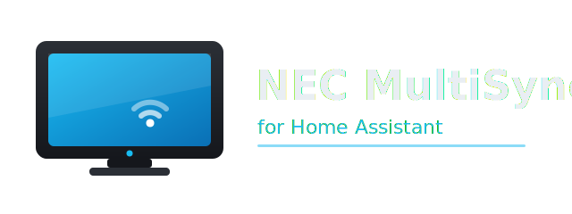

<p align="center">
  
</p>

# NEC MultiSync — Home Assistant integration

[](https://github.com/stsybizov/ha-nec-multisync/actions/workflows/validate.yaml)
[](https://github.com/hacs/integration)

Custom integration to control **NEC / Sharp NEC large-format displays** over the
network using the official *External Control* protocol (`nec-pd-sdk`).

Developed and tested against the **MultiSync V-series UHD** panels
(**V754Q / V864Q / V984Q**). It should also work with other P/V/X/M-series
displays that speak the same protocol — unsupported features are detected at
setup and simply not exposed.

## Features

A single device is created with these entities (only those the panel supports
are added):

- **Media player** — power on/off, input source (HDMI1/2/3, DisplayPort, OPS,
  Media Player, Compute Module), volume and mute.
- **Select** — picture mode, aspect ratio, gamma, audio input, OPS slot power.
- **Number** — backlight, contrast, sharpness, color temperature.
- **Switch** — key lock, auto brightness, power save.
- **Sensors** (diagnostics) — temperature sensors, fan status, total operating
  time, power-on time, self-diagnosis, carbon footprint / savings, power mode.
- **Binary sensor** — fan problem.

## Requirements on the display

- The display must be reachable on the LAN. Control uses **TCP port 7142**
  (fixed, not configurable on the panel).
- Set **External Control** to *LAN* in the panel's menu.
- For network wake from "off", set **Standby Mode** to the normal (non-ECO)
  setting, otherwise the LAN turns off when the panel is powered off.

## Installation (HACS)

1. HACS → Integrations → ⋮ → *Custom repositories* → add this repository as an
   *Integration*.
2. Install **NEC MultiSync** and restart Home Assistant.
3. *Settings → Devices & Services → Add Integration → NEC MultiSync* and enter
   the display's IP address (and Monitor ID if daisy-chained; default 1).

Manual install: copy `custom_components/nec_multisync` into your HA
`config/custom_components/` folder and restart.

## Options

After adding, open the integration's *Configure* dialog to set:

- **Polling interval** (default 30 s — keeps the panel's 15-minute idle session
  alive).
- **Inputs to expose** as media-player sources.

## Verifying connectivity first

Before installing, you can confirm the panel responds:

```bash
pip install nec-pd-sdk pyserial
python tools/smoke_test.py <display-ip>
```

## Debug logging

Add to `configuration.yaml` and restart:

```yaml
logger:
  default: info
  logs:
    custom_components.nec_multisync: debug
```

## Notes

- The underlying `nec-pd-sdk` is synchronous; the integration keeps one socket
  connection and runs all calls in an executor, serialized by a lock.
- Not all opcodes exist on every model; the integration probes support at setup
  and only creates entities that work.
- `DeviceInfo` is imported from `homeassistant.helpers.entity` (not
  `helpers.device_info`).

## Credits

Built on the MIT-licensed
[`nec-pd-sdk`](https://github.com/SharpNECDisplaySolutions/necpdsdk) from
Sharp NEC Display Solutions.

## License

Released under the [MIT License](LICENSE).
